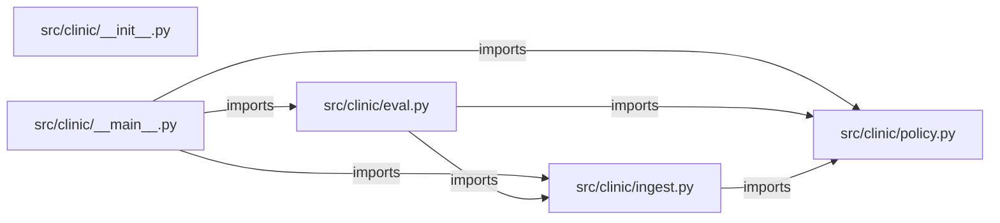

# fde-clinic-intake — project architecture

[README](README.md) · [Interview questions and answers](INTERVIEW_QA.md)

## Purpose and scope

Simulated forward deployed engagement for Northshore Clinic. The morning nurse was reading overnight portal notes in arrival order. Some had no consent. A few needed a callback before clinic opened. The clinic will not send note text to an outside model, and the tool must not diagnose.

This document describes files and symbols in this checkout. Deployment templates and statements in the original overview are distinguished from a verified running environment.

## Component diagram



For Python repositories, arrows show resolved local imports, not network calls or deployment order. Otherwise the diagram is a repository component map; containment arrows do not assert runtime integration.

## Components and responsibilities

| Component | Responsibility |
| --- | --- |
| [`src/clinic/policy.py`](src/clinic/policy.py) | Functions: `sentences`, `_urgent_sentence`, `route_note`, `audit_event`, `render` |
| [`src/clinic/eval.py`](src/clinic/eval.py) | Functions: `run` |
| [`src/clinic/ingest.py`](src/clinic/ingest.py) | Functions: `load_notes`, `load_cases` |
| [`requirements.txt`](requirements.txt) | Implementation or supporting configuration |
| [`src/clinic/__init__.py`](src/clinic/__init__.py) | Implementation or supporting configuration |
| [`src/clinic/__main__.py`](src/clinic/__main__.py) | Functions: `main` |
| [`Dockerfile`](Dockerfile) | Container build/service configuration |
| [`tests/test_policy.py`](tests/test_policy.py) | Executable checks and regression examples |
| [`.github/workflows/ci.yml`](.github/workflows/ci.yml) | GitHub Actions job definitions |
| [`README.md`](README.md) | Project explanations or operating notes |
| [`docs/01-discovery.md`](docs/01-discovery.md) | Project explanations or operating notes |
| [`docs/02-security.md`](docs/02-security.md) | Project explanations or operating notes |

## Existing design and operating guides

These checked-in guides provide the project’s detailed design, operational context, or deployment view:

- [`docs/01-discovery.md`](docs/01-discovery.md).
- [`docs/02-security.md`](docs/02-security.md).

## Implementation walkthrough

### `route_note(notes: dict[str, Note], note_id: str)`

Source: [`src/clinic/policy.py`](src/clinic/policy.py#L55).

Calls visible in this function: `Decision`, `NoteNotFound`, `_urgent_sentence`, `note.consent.strip`, `note.consent.strip().lower`.

```python
def route_note(notes: dict[str, Note], note_id: str) -> Decision:
    try:
        note = notes[note_id]
    except KeyError as exc:
        raise NoteNotFound(note_id) from exc
    citation = f"data/notes.csv#{note.note_id}"
    if note.consent.strip().lower() != "yes":
        return Decision(
            note_id=note.note_id,
            route="blocked_consent",
            reason="Consent is not yes, so the note body is not copied into the decision.",
            citation=citation,
        )
    urgent = _urgent_sentence(note.text)
    if urgent:
        return Decision(
            note_id=note.note_id,
            route="urgent_callback",
            reason=f"Call the on-call nurse before the morning queue. Trigger sentence: {urgent}",
            citation=f"{citation}#{urgent}",
        )
    return Decision(
```

The excerpt is truncated; the linked source contains the full implementation.

### `run(path: Path | None=None)`

Source: [`src/clinic/eval.py`](src/clinic/eval.py#L9).

Calls visible in this function: `case.get`, `decision.render`, `failures.append`, `len`, `load_cases`, `load_notes`, `print`, `route_note`.

```python
def run(path: Path | None = None) -> int:
    notes = load_notes()
    failures = []
    cases = load_cases(path)
    for case in cases:
        decision = route_note(notes, case["note_id"])
        if decision.route != case["expected_route"]:
            failures.append(f"{case['note_id']}: {decision.route}")
        if case["expected_citation"] not in decision.citation:
            failures.append(f"{case['note_id']}: citation {decision.citation}")
        if case.get("body_forbidden") and case["body_forbidden"] in decision.render():
            failures.append(f"{case['note_id']}: echoed blocked text")
    if failures:
        print(f"{len(failures)} eval failure(s)")
        for failure in failures:
            print(f"- {failure}")
        return 1
    print(f"{len(cases)} eval cases passed")
    return 0
```

### `load_notes(path: Path | None=None)`

Source: [`src/clinic/ingest.py`](src/clinic/ingest.py#L14).

Calls visible in this function: `(path or DATA_DIR / 'notes.csv').open`, `Note`, `csv.DictReader`.

```python
def load_notes(path: Path | None = None) -> dict[str, Note]:
    notes: dict[str, Note] = {}
    with (path or DATA_DIR / "notes.csv").open(newline="") as handle:
        for row in csv.DictReader(handle):
            note = Note(
                note_id=row["note_id"],
                patient_token=row["patient_token"],
                consent=row["consent"],
                text=row["text"],
            )
            notes[note.note_id] = note
    return notes
```

### `render(self)`

Source: [`src/clinic/policy.py`](src/clinic/policy.py#L29).

Calls visible in this function: `RuntimeError`, `text.lower`.

```python
    def render(self) -> str:
        text = (
            f"Note {self.note_id} route: {self.route}.\n"
            f"{self.reason}\n"
            f"Citation: {self.citation}\n"
            "This is a queue decision for the on-call nurse. It is not a diagnosis.\n"
        )
        lowered = text.lower()
        for word in FORBIDDEN:
            if word in lowered and word not in "this is a queue decision for the on-call nurse. it is not a diagnosis.":
                raise RuntimeError(f"decision text must not contain {word}")
        return text
```

## Validation and failure paths

| Explicit exception | Source |
| --- | --- |
| `SystemExit(main())` | [`src/clinic/__main__.py`](src/clinic/__main__.py#L25) |
| `NoteNotFound(note_id)` | [`src/clinic/policy.py`](src/clinic/policy.py#L59) |
| `RuntimeError(f'decision text must not contain {word}')` | [`src/clinic/policy.py`](src/clinic/policy.py#L39) |

These are explicit exceptions in the inspected source, rather than a claim that every failure is handled. Follow the calling handler to see whether the exception becomes an HTTP response or propagates.

## Data and state

- [`src/clinic/policy.py`](src/clinic/policy.py) defines module-level containers: `URGENT_WORDS`.

Module-level dictionaries/lists live in a Python process. They can be fixtures or mutable state; inspect writes before treating them as persistent storage. A production extension would need to define persistence and concurrency behavior explicitly.

## Data flow and design decisions

### What is the input-to-output contract of `route_note`

In [`src/clinic/policy.py`](src/clinic/policy.py#L55), `route_note(notes: dict[str, Note], note_id: str)` receives the inputs. The function computes these intermediate values:

- `citation = f'data/notes.csv#{note.note_id}'`
- `urgent = _urgent_sentence(note.text)`

Its result is defined by:

- `Decision(note_id=note.note_id, route='nurse_queue', reason='No urgent wording. Leave it on the morning nurse queue.', citation=citation)`
- `Decision(note_id=note.note_id, route='blocked_consent', reason='Consent is not yes, so the note body is not copied into the decision.', citation=citation)`
- `Decision(note_id=note.note_id, route='urgent_callback', reason=f'Call the on-call nurse before the morning queue. Trigger sentence: {urgent}', citation=f'{citation}#{urgent}')`

### Which decision rules or boundary conditions should an interviewer challenge

The implementation in [`src/clinic/policy.py`](src/clinic/policy.py#L55) branches on:

- `note.consent.strip().lower() != 'yes'`
- `urgent`

A useful extension is a table-driven test that covers each condition just below, at, and above its boundary where applicable. These expressions are the current rules; changing them changes behavior and should be justified by the project’s acceptance criteria.

## Setup and verification

The following commands are derived from the checked-in dependency/test contracts. Execute them from the repository root; the block prepares a local environment, not a cloud deployment.

```bash
python3 -m venv .venv
source .venv/bin/activate
python -m pip install -r requirements.txt
python -m pytest -q
```

Python dependencies: [`requirements.txt`](requirements.txt).

Test entry points: [`tests/test_policy.py`](tests/test_policy.py).

Automation definitions: [`.github/workflows/ci.yml`](.github/workflows/ci.yml). Read their triggers and job steps to determine what CI actually runs.

## Operating boundaries and design review

Before turning this checkout into a customer deployment, establish the input contract, data ownership, access controls, failure response, evaluation criteria, and rollback owner. Repository fixtures and unit tests demonstrate local behavior; they do not establish throughput, uptime, compliance, or business impact.

A useful architecture review starts with the linked implementation: identify where input enters, where a decision is made, which state can change, and which external dependency can fail. Add a deployment view only for infrastructure that is actually configured and exercised.
